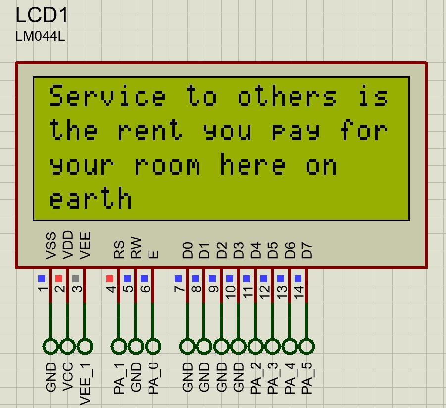
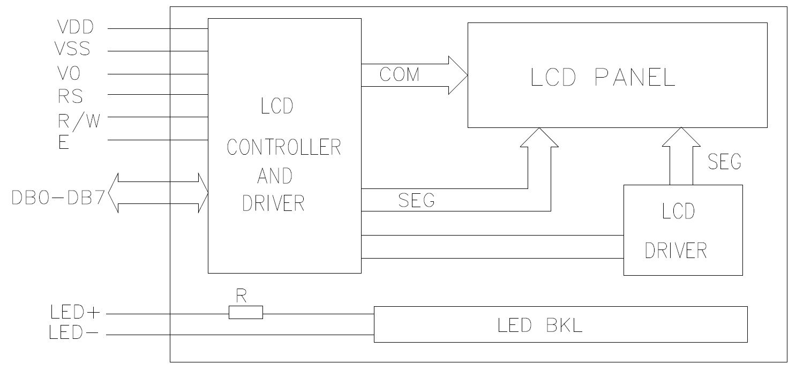

# About
Character LCD displays pattern for time-triggered embedded systems.

# Acknowledgment
The pattern is taken from the book <b>Patterns for Time-Triggered Embedded Systems</b> <i>by Michael J. Pont</i>

# Demo

  

# LCD Block Diagram

  

