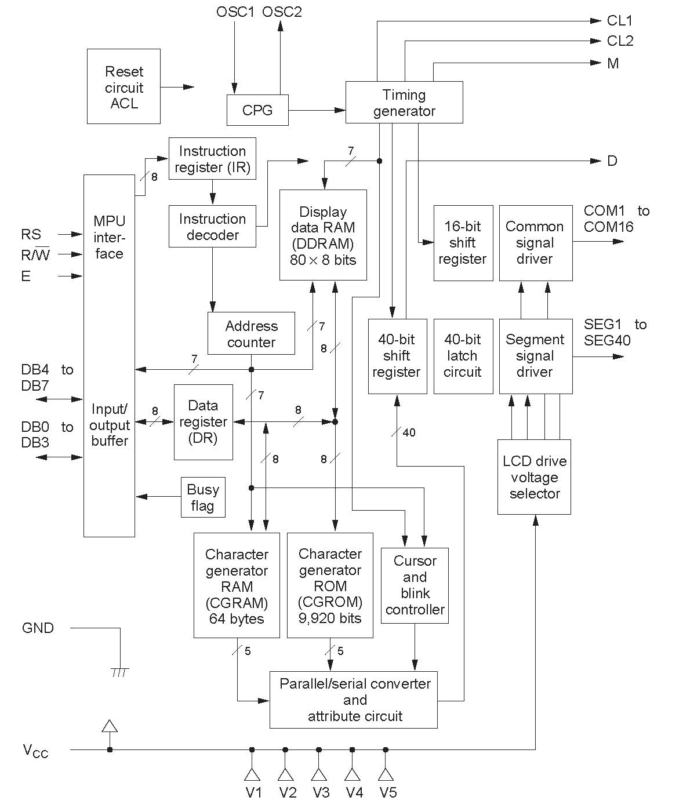
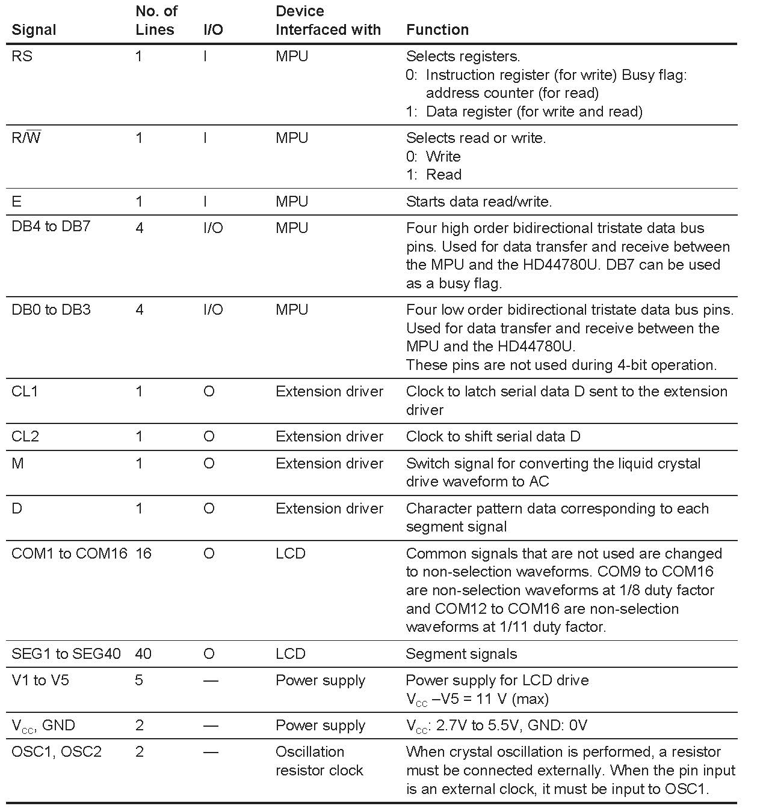
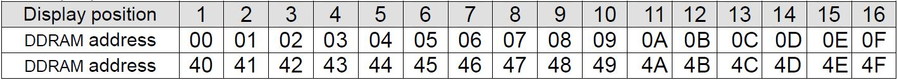
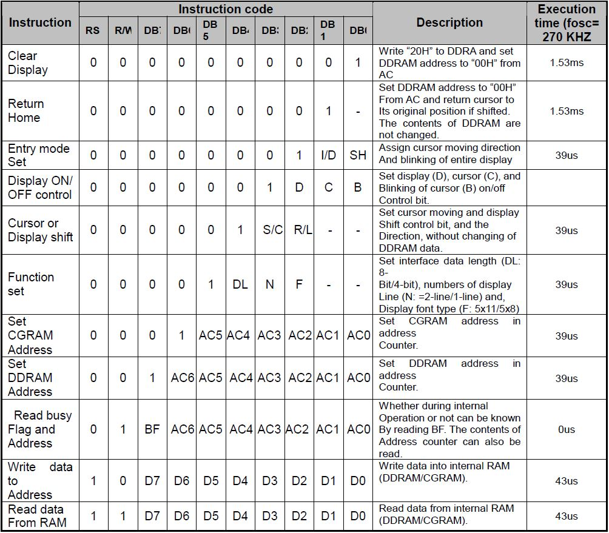

# About
Character LCD displays pattern for time-triggered embedded systems.

# Acknowledgment
The pattern is taken from the book <b>Patterns for Time-Triggered Embedded Systems</b> <i>by Michael J. Pont</i>

# Demo

  

# LCD Block Diagram

  

#### BKL: backlight

# LCD Controller Block Diagram

  

# Pin Functions

  

# Function Description

## Address Counter (AC)
The address counter (AC) assigns addresses to both DDRAM and CGRAM. When an address of an
instruction is written into the IR, the address information is sent from the IR to the AC. Selection of either
DDRAM or CGRAM is also determined concurrently by the instruction.

## Display Data RAM (DDRAM)
Display data RAM (DDRAM) stores display data represented in 8-bit character codes. Its extended
capacity is 80 × 8 bits, or 80 characters. The area in display data RAM (DDRAM) that is not used for
display can be used as general data RAM.

  

## Character Generator ROM (CGROM)
The character generator ROM generates 5 × 8 dot or 5 × 10 dot character patterns from 8-bit character
codes (Table 4). It can generate 208 5 × 8 dot character patterns and 32 5 × 10 dot character patterns. Userdefined character patterns are also available by mask-programmed ROM.

## Character Generator RAM (CGRAM)
In the character generator RAM, the user can rewrite character patterns by program. For 5 × 8 dots, eight
character patterns can be written, and for 5 × 10 dots, four character patterns can be written.

# Commands

  

